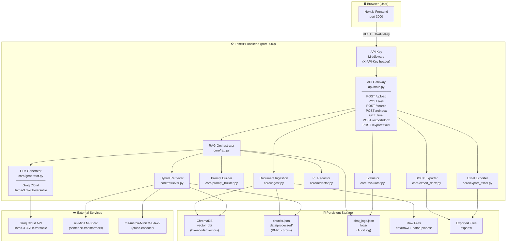
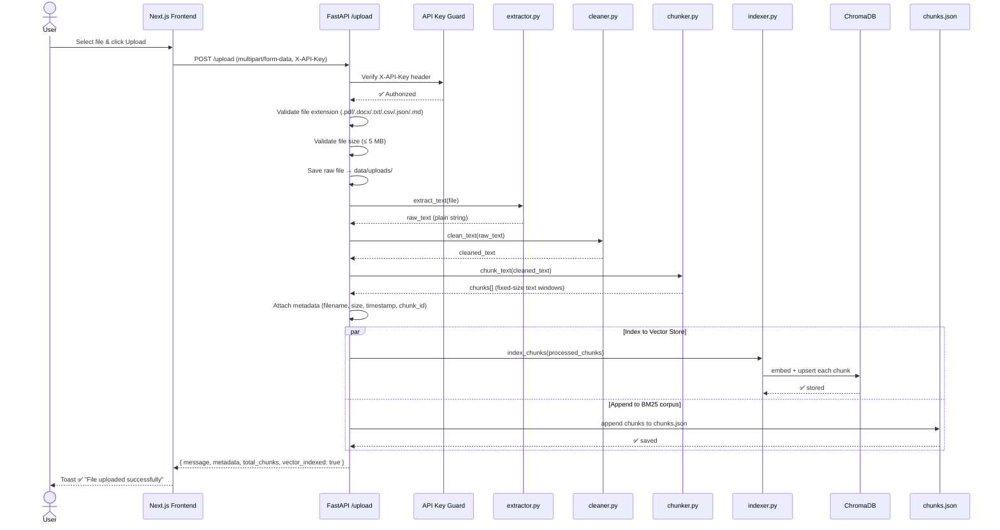
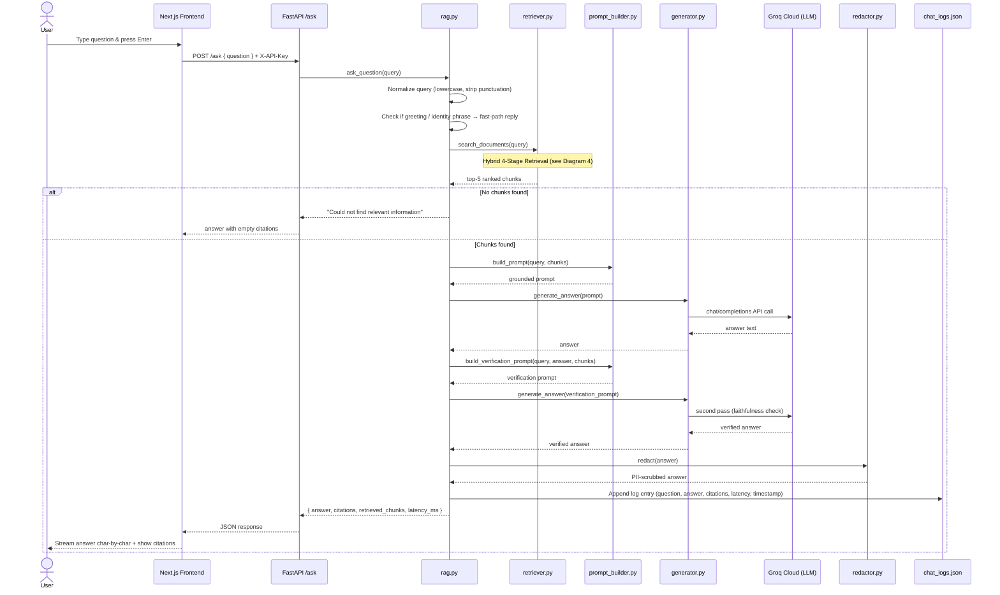
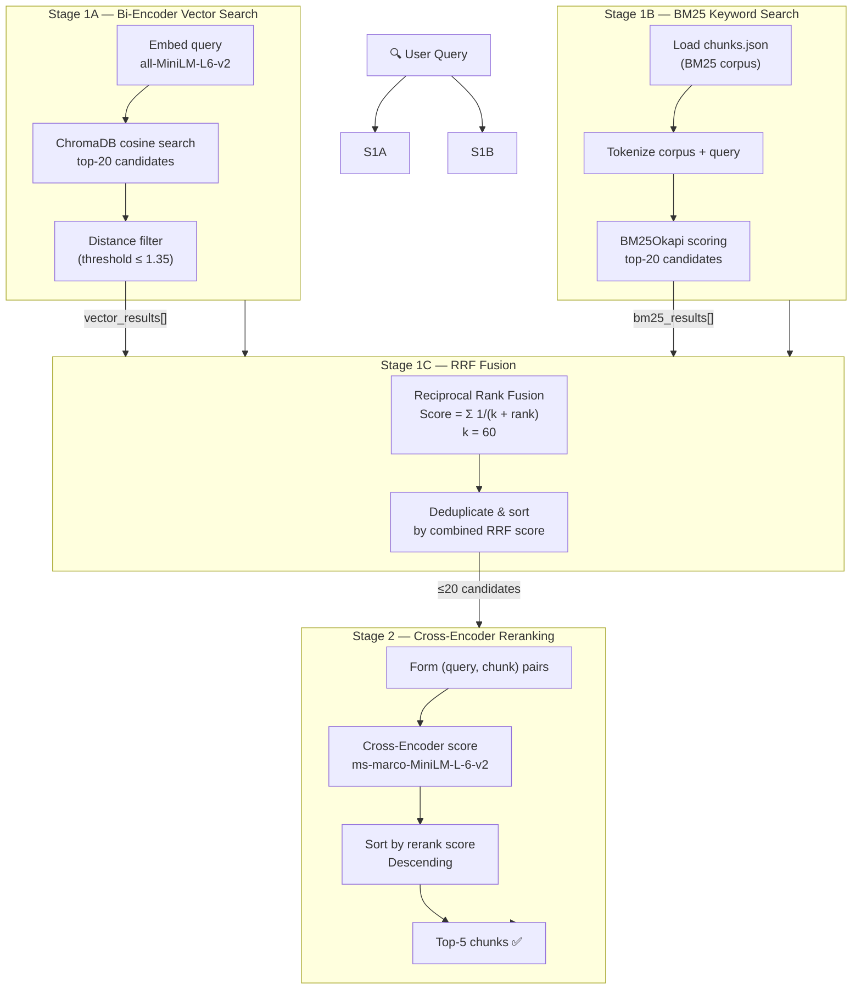
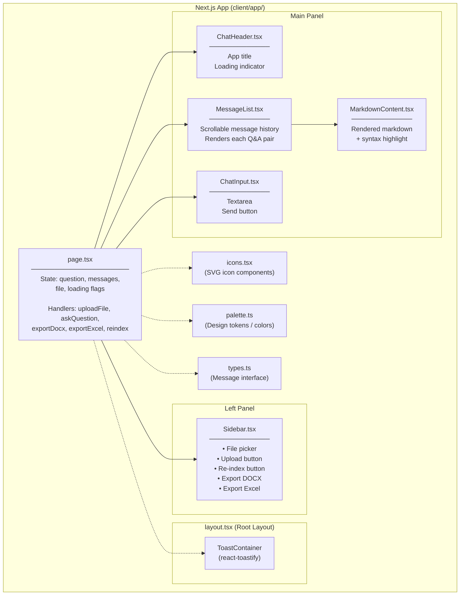
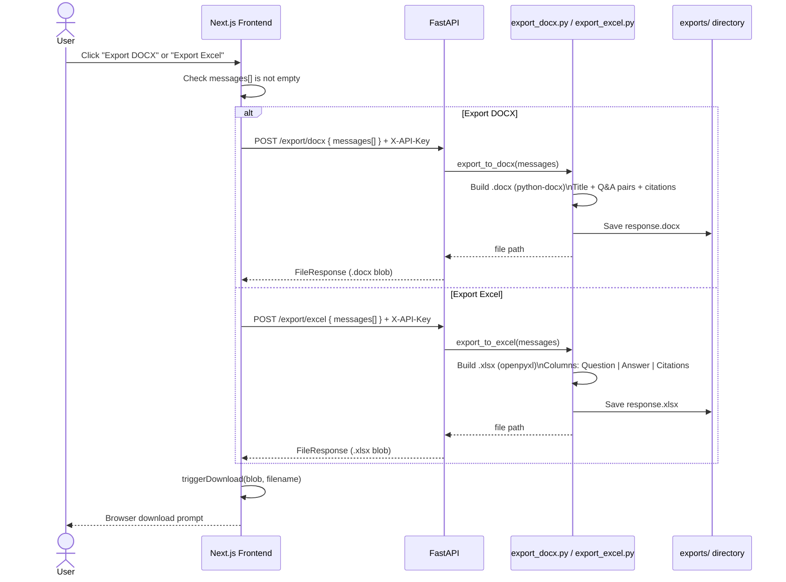
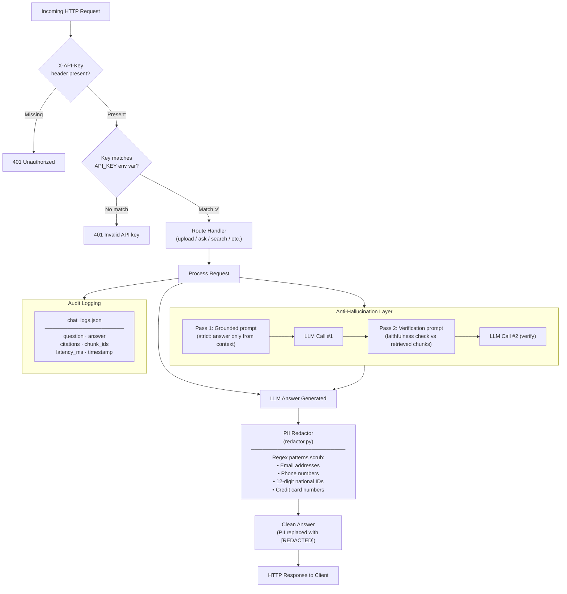
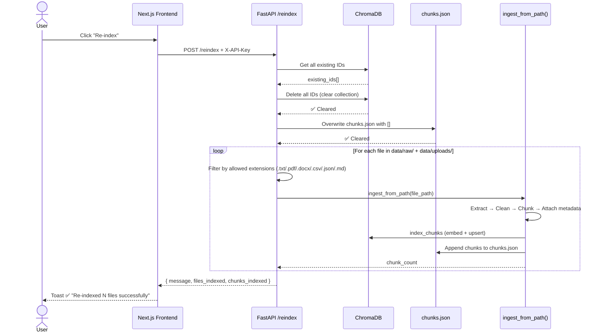
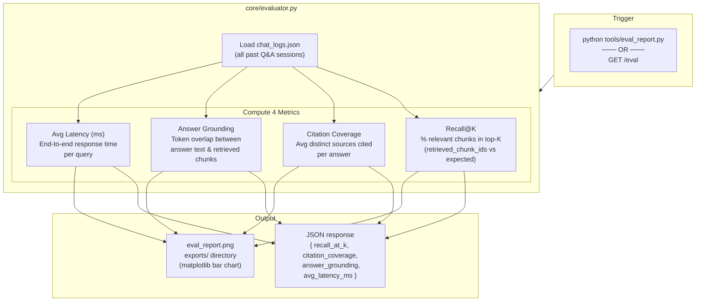
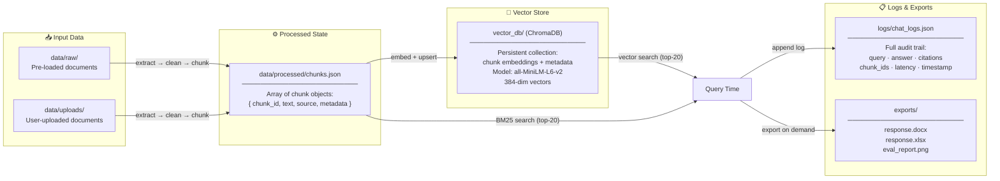

# AI Knowledge Assistant — High Level Design Diagrams

> All diagrams use [Mermaid](https://mermaid.js.org/) syntax.  
> Render in GitHub, VS Code (Markdown Preview Mermaid Support), or [mermaid.live](https://mermaid.live).

---

## 1. Overall System Architecture

---

## 2. Document Ingestion Flow

---

## 3. RAG Query & Answer Flow

---

## 4. Hybrid Retrieval Pipeline (4 Stages)

---

## 5. Frontend Component Architecture

---

## 6. Export Flow

---

## 7. Security Architecture

---

## 8. Re-index Flow

---

## 9. Evaluation Pipeline

---

## 10. Data & Storage Layer

